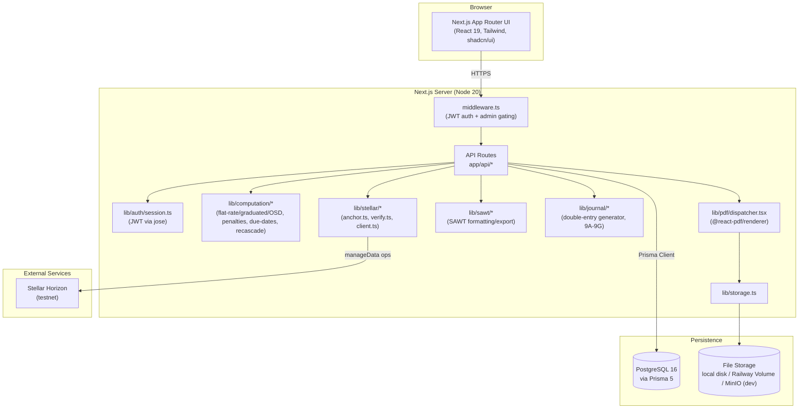
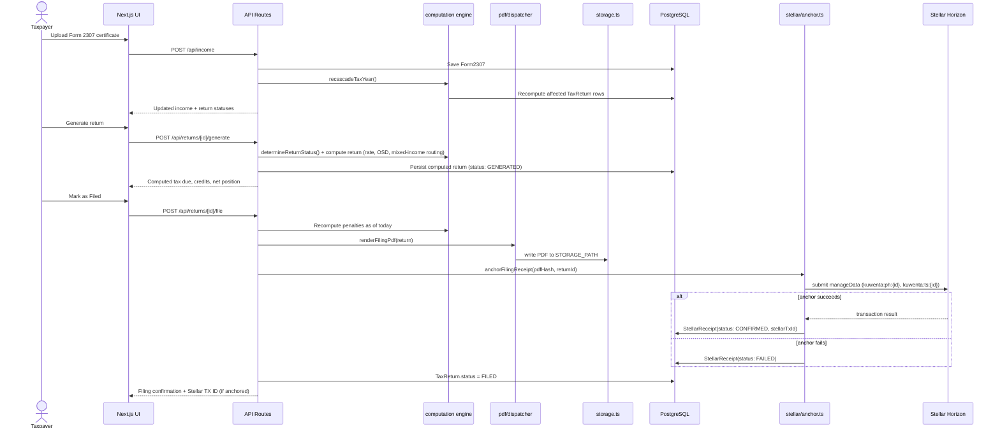
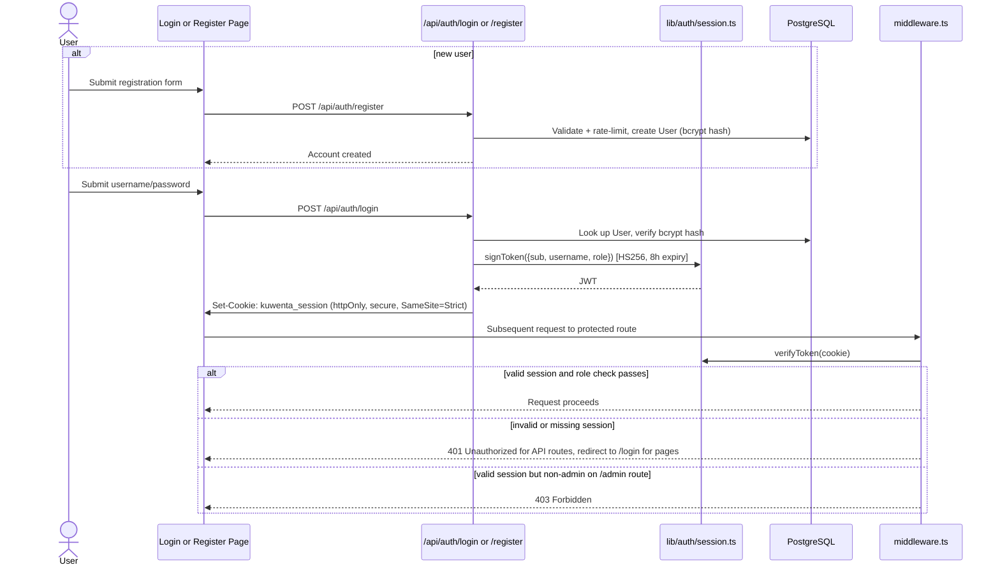
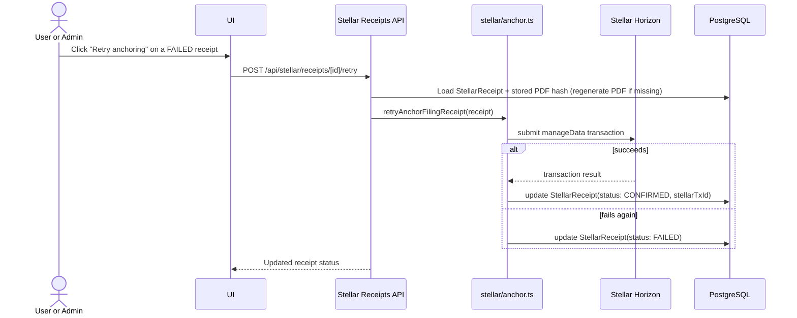

# Krunchr

> Compliance Engine — Philippine tax filing, automated and anchored on-chain.

Krunchr is a web application that automates Philippine BIR tax compliance for self-employed freelancers and mixed-income earners on the 8% flat income-tax rate, and cryptographically anchors proof of every filed return on the Stellar network. A user uploads their BIR Form 2307 withholding certificates; Krunchr computes their full tax position, walks them through all eight legally-mandated returns (2551Q ×4, 1701Q ×3, 1701A/1701) in the correct statutory order, generates ready-to-file BIR PDFs and a SAWT summary, and — on filing — SHA-256-hashes the signed return and writes that hash to the Stellar ledger as a `manageData` entry. The result is a compliance record that isn't just "saved to a database," but independently, publicly verifiable by anyone who queries the chain: a bank underwriting a loan, an embassy processing a visa, or a BIR auditor, in seconds, without trusting Krunchr's servers.

For the Stellar ecosystem, Krunchr is a live, non-speculative "Real World Access" use case in a market where Stellar already has payment-rail traction (Coins.ph, MoneyGram's PHP/USDC corridor) but — as far as this project's research could establish — no shipped tax-compliance or government-RegTech product: it demonstrates Stellar's low-cost `manageData`/anchoring primitives solving an actual, everyday compliance problem for millions of Philippine freelancers, and opens a path toward deeper ecosystem integration — Soroban-based attestation registries, SEP-12/24 anchor payouts for freelancers paid in USDC, and portable verifiable-compliance credentials — that go well beyond the current hash-anchoring implementation.

## Status

| | |
|---|---|
| **Version** | `0.1.0` (from `package.json`; no git tags/releases published) |
| **Branch** | `develop` (default), CI runs on `develop` and `main`; CI currently green |
| **License** | Released under the MIT License. Copyright © 2026 Artisam Labs.|
| **Track** | APAC Stellar Hackathon 2026 — Local Finance & Real World Access |


## 🧩 Problem

Filipino self-employed professionals and freelancers must file up to **8 sequential BIR returns per year** (2551Q ×4, 1701Q ×3, 1701A), each with strict prerequisite ordering, statutory deadlines, and legally-specific computation rules — e.g. mixed-income earners get no ₱250,000 exemption and must use Form 1701 instead of 1701A; the 8% election is irrevocable once made; RA 11976 changed penalty rates (10% surcharge / 6% interest, not the old 25%/12%); the ₱500 registration fee was abolished in favor of a ₱30 DST; graduated-rate filers can additionally elect a 40% Optional Standard Deduction. Manual filing is error-prone against this many interacting rules, and once filed, there is no simple, verifiable way for a third party (a bank, an embassy, an auditor) to confirm a return was genuinely filed and unaltered.

## 🌟 Vision 

Built for the **APAC Stellar Hackathon 2026 — Local Finance & Real World Access** track, Krunchr's stated goal is a single demo moment: a freelancer uploads their 2307 certificates, the system computes their full tax position, generates all sequenced returns, and each filed return is permanently anchored on Stellar — producing a compliance trail that banks and embassies can verify in seconds. That demo moment is implemented and working end-to-end today. Beyond the hackathon deliverable, the codebase has grown into a fuller compliance product — self-service registration, graduated-rate and OSD computation, SAWT generation, prior-year-credit lineage tracking, and a nearly-complete admin console — positioning it as a real product rather than a single demo path.

## 👥 Target Users

- **Self-employed freelancers on the 8% flat rate** — need a guided, correct-by-construction path through 8 mandatory returns without hiring an accountant for every quarter.
- **Graduated-rate filers** — need TRAIN-law bracket computation and an optional 40% standard deduction, correctly kept mutually exclusive from the 8% election.
- **Mixed-income earners (salary + freelance)** — need computations that correctly skip the ₱250,000 exemption and route to Form 1701 instead of 1701A.
- **Banks / embassies / third-party verifiers** — need a fast, tamper-evident way to confirm a filing actually happened, via the Stellar-anchored hash rather than trusting a scanned PDF.
- **BIR-compliance admins** *(role: `ADMIN`)* — need to manage ATC codes, RDO penalty schedules, holiday calendars, users, and audit logs across taxpayers.

## ✨ Features

**Auth & Onboarding**
- Self-service registration with rate limiting and Zod validation, alongside seeded accounts — `app/register`, `/api/auth/register`
- 4-step taxpayer onboarding (personal info, eligibility, ATC setup, tax-year init) with TIN normalization and ZIP lookup — `app/(dashboard)/onboarding`
- 5-point eligibility validation (individual taxpayer, self-employment income, non-VAT, gross receipts < ₱3,000,000, no prior graduated-rate Q1 filing) — `/api/taxpayer/eligibility`, `lib/computation/eligibility.ts`
- ATC code setup with a lookup table and admin-configurable EWT rates — `/api/atc`
- Contextual tooltips and empty-state guidance across onboarding/election/dashboard for first-time users — `components/ui/info-tooltip`, per-page `loading.tsx`/empty states

**Income Management**
- Form 2307 (withholding certificate) CRUD, grouped by quarter and payor, with CWT-vs-ATC-rate auto-validation — `/api/income`, `/api/income/[id]`
- YTD income/CWT summaries and VAT-threshold tracking (with an 80%-of-₱3M warning), PDF/Excel export — `/api/income/summary`, `/api/income/summary/export`
- Every 2307 mutation triggers a recascade of all downstream return computations — `lib/computation/recascade.ts`, `/api/computation/recascade`

**Tax Rate Election & Computation**
- Supports all three legal election paths — Item 13 (2551Q Q1), Item 16 (1701Q Q1), or Form 1905 — with the actual BIR line item resolved and stored separately from the recording method — `/api/election`, `lib/election-rules.ts`
- Mandatory disclosure confirmation before locking the election, logged to the audit trail — `/api/election/history`
- 8% flat-rate **and** TRAIN-law graduated-bracket computation, plus an optional 40% Optional Standard Deduction (mutually exclusive with the 8% rate, enforced at the computation layer) — `lib/computation/constants.ts` (`TRAIN_BRACKETS`), `annual-income.ts`, `quarterly-income.ts`
- Dry-run computation preview without persisting — `/api/computation/preview`
- Penalty computation and forecasting under RA 11976 reduced rates (10% surcharge, 6% interest), with RDO-specific compromise penalties and holiday-aware due dates — `lib/computation/penalties.ts`, `due-dates.ts`, `/api/penalties/[returnId]`, `/api/penalties/simulate`
- Prior-year credit lineage tracking and overpayment disposition (carry-over / refund / tax credit certificate), modeled as a full settlement lifecycle — `lib/prior-year-credit-lineage.ts`, `/api/prior-year-credit/[id]`, `/api/overpayment/[taxYear]`

**Filing Sequence & Documents**
- Enforces the legally-mandated return order (8-return or 4-return path depending on COR) with `BLOCKED → PENDING → GENERATED → FILED` status gating — `lib/computation/sequence.ts`, `/api/returns/sequence`
- Server-side BIR-form PDF generation via `@react-pdf/renderer` for 2551Q, 1701Q, 1701A, and 1701 (mixed-income) — `lib/pdf/dispatcher.tsx`, `lib/pdf/templates/`
- SAWT (Summary Alphalist of Withholding Taxes) generation with attachments, plus a full filing-package ZIP (all return PDFs + cover sheet + SAWT) — `/api/sawt`, `/api/sawt/export`, `/api/sawt/attachments`, `/api/filing-package/download`
- Auto-generated double-entry journal entries (subsections 9A–9G, ~20 entry types) on filing/election/overpayment events, with chart-of-accounts lookup and CSV/XLSX export — `lib/journal/`, `/api/journal/*`

**Stellar Blockchain Anchoring**
- On filing, the return PDF is SHA-256 hashed and anchored via two Stellar `manageData` operations (hash + ISO timestamp, keys `kuwenta:ph:{id}`/`kuwenta:ts:{id}`) — `lib/stellar/anchor.ts`
- Anchoring failure does not block filing; a `StellarReceipt` is created/updated with status `FAILED` and can be retried (including regenerating a missing PDF) — `/api/stellar/receipts/[id]/retry`
- On-chain verification re-fetches the Horizon `manageData` entries and compares the hash against the stored PDF, with a QR-code receipt view — `lib/stellar/verify.ts`, `/api/stellar/verify`, `app/(dashboard)/stellar`
- Horizon health/account-sequence probe — `/api/stellar/status`

**Auth & Admin**
- Username/password login, JWT (HS256) issued via `jose`, stored as an httpOnly/secure/`SameSite=Strict` cookie, 8-hour expiry — `lib/auth/session.ts`, `/api/auth/login`
- Route protection and admin gating in `middleware.ts` (`/admin/*` and `/api/admin/*` require `role === 'ADMIN'`)
- Full admin console: user list, ATC code CRUD, RDO penalty schedule, public holiday calendar, system health (Stellar + DB + storage + Prisma migration status), and filterable/exportable audit log — `/admin/*`, `/api/admin/*`
- Append-only audit log for every state-changing action (election, filing, overpayment disposition, Stellar retry) — `AuditLog` model, `/api/admin/audit-log`, `/api/admin/audit-log/export`

## Known Gaps vs `SPEC.md`

A codebase audit against `SPEC.md` found the implementation **ahead of** the spec/`CLAUDE.md` in most areas (graduated-rate computation, OSD, admin tooling, and test coverage are all further along than those docs describe), but surfaced a few real gaps worth tracking:

- **BR-17 not enforced at the API layer**: `SPEC.md`'s own rule that Form 1701A generation should be hard-blocked for taxpayers not on an active 8% election is documented in code comments (`lib/computation/annual-income.ts`) but not actually checked in `app/api/returns/[id]/generate/route.ts` — a graduated-rate-elected user could plausibly generate a 1701A today.
- **Election page UI copy is stale**: `app/(dashboard)/election/page.tsx` still displays "graduated computations are not yet implemented"-style text, even though the computation layer fully supports graduated rates and OSD.
- **No deployment-as-code**: no `Dockerfile`/`railway.json`/`railway.toml` in the repo; production deploys rely on Railway dashboard state plus runbook docs (`docs/railway-cli-runbook.md`), not committed infrastructure config.


## System Architecture



## Sequence Diagrams

### Hero flow: upload 2307 → generate → file → anchor on Stellar



### Auth flow (login and self-service registration)



### Stellar anchor retry flow (async/failure-recovery)



## Smart Contracts

All Stellar interaction is off-chain SDK usage (`@stellar/stellar-sdk`) submitting `manageData` operations directly — there is currently no on-chain contract layer, so no contract address exists yet. Instead, the project's on-chain identity is a single system account that signs every anchoring transaction:

- **Anchor account (testnet):** [`GDRUZM6G6W6QMXMXTT2MQMHC2772L5ZAMBRLVUI6ZFWIE5V76Y3DCMBQ`](https://stellar.expert/explorer/testnet/account/GDRUZM6G6W6QMXMXTT2MQMHC2772L5ZAMBRLVUI6ZFWIE5V76Y3DCMBQ) — derived from `STELLAR_SECRET_KEY`; every filed return's SHA-256 hash and filing timestamp are written as `manageData` entries on this account. Anyone can audit all anchored receipts by querying its data entries via Stellar Expert or Horizon — no trust in Krunchr's backend required.

See the [ecosystem-expansion research](https://github.com/webnxt-2030/krunchr/issues/191) for a proposed Soroban receipt-registry contract design.

## Tech Stack

**Frontend**
- Next.js 15.5.19 (App Router), React 19.1.0, TypeScript 5
- Tailwind CSS 4.3.1, shadcn 4.12.0, `class-variance-authority` 0.7.1, `lucide-react` 1.21.0

**Backend / API**
- Next.js API routes 
- Prisma 5 ORM over PostgreSQL
- `jose` 5 (JWT signing/verification), `bcrypt` 5 (password hashing)
- `decimal.js` 10 , `zod` 3 (validation)

**Blockchain**
- `@stellar/stellar-sdk` ^12 — Horizon client, `manageData` anchoring, keypair management (testnet, per `.env.example`)

**Documents**
- `@react-pdf/renderer` 4.5.1 (server-side PDF generation)
- `exceljs` 4.4.0, `xlsx` 0.18.5 (spreadsheet export), `jszip` 3.10.1 (filing-package ZIP), `react-qr-code` 2.2.0

**Infra / Storage**
- PostgreSQL 16 (Docker: `postgres:16-alpine`; production: Railway Postgres)
- File storage: local disk / Railway Volumes in production, MinIO (`minio/minio:latest`) for local S3-compatible dev storage

**CI / Tooling**
- pnpm package manager
- ESLint 9, Vitest 3 (`test`, `test:unit`, `test:run`, `test:ui` scripts) — 58+ test files covering computation, journal, Stellar, and API routes
- GitHub Actions (`.github/workflows/ci.yml`): lint → test (with a PostgreSQL service container) → build, on push/PR to `develop`/`main`
- GitHub Actions (`.github/workflows/deploy.yml`): triggers a Railway deploy hook on push to `main` (skips gracefully if the hook secret is unset)

## 🚀 How to Run Locally

**Prerequisites:** Node.js 20+, pnpm, Docker (for local Postgres + MinIO).

1. **Install dependencies**
   ```bash
   pnpm install
   ```

2. **Configure environment**
   ```bash
   cp .env.example .env.local
   ```
   Fill in the following. Variables marked *required* are needed for the app to start/function correctly; *optional* ones have documented fallback behavior.

   | Variable | Required? | Notes |
   |---|---|---|
   | `JWT_SECRET` | Required | HS256 signing key for session JWTs |
   | `ADMIN_PASSWORD` | Required | Bootstraps the seeded admin account |
   | `DATABASE_URL` | Required | PostgreSQL connection string |
   | `NODE_ENV` | Required | `development` / `test` / `production` |
   | `NEXTAUTH_SECRET`, `NEXTAUTH_URL` | Optional | Present in `.env.example` but auth is JWT/cookie-based via `lib/auth/session.ts`, not NextAuth |
   | `STORAGE_TYPE` | Optional | `local` (default) or `railway` |
   | `STORAGE_PATH` | Optional | Defaults to `/app/storage`; override to `./storage` on Windows if unwritable |
   | `MINIO_ENDPOINT`/`MINIO_PORT`/`MINIO_ACCESS_KEY`/`MINIO_SECRET_KEY`/`MINIO_BUCKET` | Optional | Only used with local MinIO dev storage |
   | `STELLAR_SECRET_KEY` | Required for anchoring | Without it, filing still succeeds but Stellar anchoring fails and a `FAILED` `StellarReceipt` is created (retryable) |
   | `STELLAR_NETWORK`, `STELLAR_HORIZON_URL` | Optional | Default to Stellar testnet |
   | `RAILWAY_VOLUME_MOUNT_PATH` | Optional | Only relevant when `STORAGE_TYPE=railway` in production |

3. **Start local services**
   ```bash
   docker-compose up -d
   ```
   Starts PostgreSQL 16 and MinIO.

4. **Run migrations and seed data**
   ```bash
   pnpm prisma migrate deploy
   pnpm prisma db seed
   ```
   `migrate deploy` applies pending migrations without creating new ones — use on every fresh clone/pull. `migrate dev` is only needed after editing `prisma/schema.prisma`. If seeding fails with a missing `DATABASE_URL`, run `pnpm tsx --env-file=.env.local prisma/seed.ts` instead.

5. **Start the dev server**
   ```bash
   pnpm dev
   ```

6. **(Optional) Run tests / lint**
   ```bash
   pnpm lint
   pnpm test        # or: pnpm test:unit / pnpm test:run / pnpm test:ui
   ```

Seeded accounts: admin (`admin` / `$ADMIN_PASSWORD`) and test taxpayers `maria`, `juan`, `anna` (all password `Test1234!`), fully onboarded with a 2026 tax year. New taxpayers can also self-register via `/register`.

## 🌐 Deployment

The app deploys to **Railway**, which hosts the Next.js app, PostgreSQL database, and file storage together. On push to `main`, CI POSTs to a Railway deploy-hook URL stored in the `RAILWAY_DEPLOY_HOOK` GitHub secret (the workflow skips deployment gracefully if the secret is unset). `docs/railway-env.md` and `docs/railway-cli-runbook.md` document Railway-specific environment setup and CLI recipes. There is no `Dockerfile`/`railway.json` committed to the repo — deploy configuration currently lives in the Railway dashboard rather than as code.

- **Production URL:** `https://app.krunchr.xyz/`

## Demo

- **Live app:** `https://krunchr.xyz/`
- **Demo video:** `https://drive.google.com/drive/folders/11WN3vL8cmt9BONtL-ZYhmI9h4okpqK7b`
- **Pitch deck:** `https://docs.google.com/presentation/d/1XH8VVeQiOx_EedatgHA3xo1HOmKepcue/edit?usp=sharing&ouid=107646735560696939398&rtpof=true&sd=true`

## Team

| Name | Role | Contact |
|---|---|---|
| `Artisam Labs` | `Incubator` | `hello@artisam.xyz` |
| `Neil John Rivera` | `Builder` | `neiljohn.rivera.work@gmail.com` |

## License

Released under the MIT License. Copyright © 2026 Artisam Labs.

## Further Reading

- [`SPEC.md`](./SPEC.md) — full product specification and business rules
- [`AGENT.md`](./AGENT.md) — coding conventions for contributors/agents
- [`BRAND.md`](./BRAND.md) — design system and brand identity
- [`LOGO.md`](./LOGO.md) — logo generation prompts
- [`docs/features.md`](./docs/features.md) — auto-generated feature changelog
- [`docs/quick-start-guide.md`](./docs/quick-start-guide.md) — first-time user walkthrough
- [`docs/test-flow-guide.md`](./docs/test-flow-guide.md) — end-to-end demo/test flow guide
- [`docs/client-update.md`](./docs/client-update.md) — current project status in plain language
- [`docs/client-guides/INDEX.md`](./docs/client-guides/INDEX.md) — client-provided BIR form guides and study materials
- [`docs/migrations.md`](./docs/migrations.md) — database migration conventions
- [`docs/railway-env.md`](./docs/railway-env.md) — Railway environment/deployment notes
- [`docs/railway-cli-runbook.md`](./docs/railway-cli-runbook.md) — Railway CLI one-off command recipes
- [Stellar ecosystem expansion research and business-impact analysis](https://github.com/webnxt-2030/krunchr/issues/191) — GitHub issue #191
